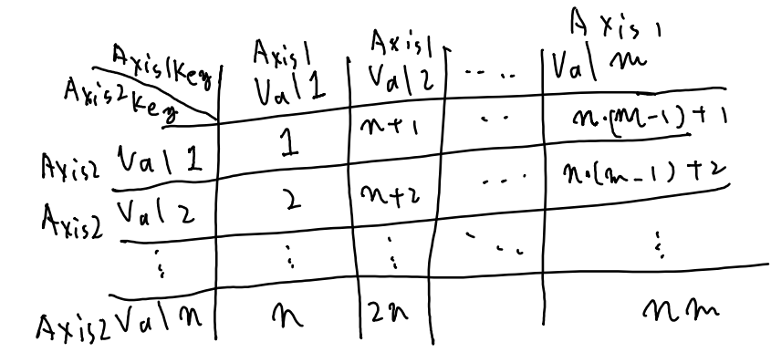

# Consecutive Experiments

KamiSimulator can simulate automatically while varying parameters, if you want.

You can enable this feature by setting the ```DoConsecutiveExperiments``` key to true, and adding the consecutive experiments' setting JSON path as the ```ConsecutiveExperimentsJsonPath``` and Solver's base setting JSON path as the ```ConsecExpBaseJsonPath``` in the KamiSimulator's settings JSON.

The consecutive experiment's setting parameters are listed below.

- ***JsonKeyName***, **KeyType**, *Domain*, Default Value
  Description
- ***ResultNamePrefix***, **string**, *arbitrary*, "" (empty)
  This value decides the prefix of the output files' names. For example, if the value is "SCR", then the output file names are "SCR_Axis1Key_Axis1Val_Axis2Key_Axis2Val*".
- ***NumOfAxis***, **int**, *{1, 2}*, 1
  You don't have to set this parameter because it's set automatically by referring to the others.
- ***Axis1Key***, **KeyType**, *arbitrary*, "" (empty)
  This is the key in the solver's setting JSON that you want to vary.
- ***Axis2Key***, **KeyType**, *arbitrary*, "" (empty)
  This is the key in the solver's setting JSON that you want to vary. You can keep this key empty for 1D experiments.
- ***Axis1Type***, **KeyType**, *{"bool", "int", "float", "string"}*, "" (empty)
  This value should match the corresponding Solver's setting value type.
- ***Axis2Type***, **KeyType**, *{"bool", "int", "float", "string"}*, "" (empty)
  This value should match the corresponding Solver's setting value type.
- ***Axis1Val***, **vector<Axis1Key>**, *arbitrary*, empty vector
  Here, you put the values that you want to vary.
- ***Axis2Val***, **vector<Axis2Key>**, *arbitrary*, empty vector
  Here, you put the values that you want to vary.

Assuming all the above parameters are set, the execution order is as follows.


