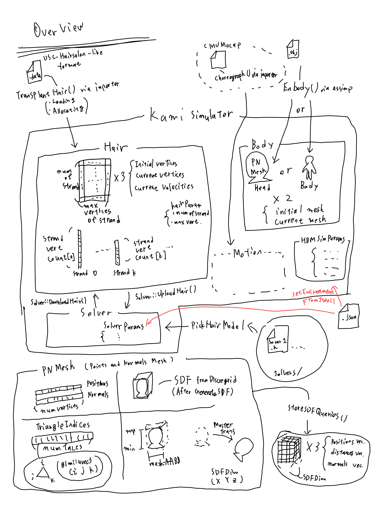
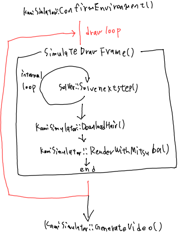

# Basic Features

- Simulating hair with [Augmented-MS]( https://computationalsciences.org/publications/amador-herrera-2025-hair-simulation.html ) / [Stable Cosserat Rods]( https://jerryhsu.io/projects/StableCosseratRods/ )
- Cantilever testing with the above algorithms
- Running the simulator while varying parameters, if you want

## Overview

## I/O

Input:	USC-HairSalon-like format hair data
Output: Video / USC-HairSalon-like format hair data / Image sequence

## Simulation Flow

## Setting Simulation Parameters

You can use the simulator manually in C++ code or modify simulation parameters by specifying a JSON file.
If you want to use it in C++, [main.cpp](../src/main.cpp) is a good example.

The KamiSimulator's parameters that can be modified in the .json file are listed below. The same description can be seen at [KamiSimulator.h](../src/KamiSimulator.h). Samples' descriptions are also listed.

### Parameters Description

- ***JsonKeyName***, **KeyType**, *Domain*, Default Value
  Description
- ***OutputNamePrefix***, **String**, *arbitrary string*, "test"
  OutputNamePrefix specifies the name of the files that contain simulation results. DO NOT include any extensions and directories in the value.
- ***OutputType***, **String**, *{"NOTHING", "SEQUENTIAL_OBJ_AND_DATA", "VIDEO_ONLY", "VIDEO_AND_OBJ"}*, ""
  OutputType specifies an output format. OBJ means body Mesh file(.obj), and DATA means hair data(.data).
- ***EnableLog***, **Bool**, *{true, false}*, false
  Enable outputting the log file.
- ***DoConsecutiveExperiments***, **Bool**, *{true, false}*, false
   Start consecutive experiments if this value is true. The details are in the [consecutive experiments page](consec.md).
- ***ConsecutiveExperimentsJsonPath***, **String**, *arbitrary string*, ""
  The path of the JSON file for consecutive experiments, which includes an extension .json. The parameters are described in the [consecutive experiments page](consec.md).
- ***ConsecExpBaseJsonPath***, **String**, *arbitrary string*, ""
  The path of the JSON for the solver's parameters that are consistent across the consecutive experiments.
- ***HairPath***, **String**, *arbitrary string*, ""
  Hair file's path. If this remains empty, TransplantHair(10, 100), which creates a horizontal hair array, will be called.
- ***BodyPath***, **String**, *arbitrary string*, ""
  Body's path. If this remains empty, EmBody(), which creates a box, will be called.
- ***BodyType***, **String**, *{"HEAD_ONLY, "FULL_BODY", "BOX"}*, ""
  Body's type. f this remains empty, EmBody(), which creates a box, will be called.
- ***BoxMin***, **Vector<Float>**, *R^3*, (empty)
  Box's minimal corner's position. This value is referred to if BodyType is BOX.
- ***BoxMax***, **Vector<Float>**, *R^3*, (empty)
  Box's maximal corner's position. This value is referred to if BodyType is BOX.
- ***SimulationTimings***, **Vector<Int>**, *(Z^+)^3*, [2, 60, 5]
  This value is a triplet as (simulation length (s), frame per sec(f/s), internal step (draw step)).
- ***SolverModel***, **String**, *{"AUG_MASS_SPRING", "STABLE_COSSERAT_RODS", "CANTILEVER"}*
  This value corresponds to the solver that you will use. CANTILEVER's datails are described in the [Cantilever Test page](cantil.md).
- ***SolverSettingPath***, **String**, *arbitrary string*, ""
  The path of the JSON file for the solver that you are going to use. The details are shown in the corresponding solver's header.
- ***CameraPos***, **Vector<Float>**, *R^3*, [0, 1.6, 2.2] (BodyType == HEAD_ONLY or FULL_BODY) or [0.12, .14, .5] (BodyType == BOX)
  A camera's setting. You must fill all the camera's parameters if you set the camera manually.
- ***CameraLookAt***, **Vector<Float>**, *R^3*, [0, 1.6, 0] (BodyType == HEAD_ONLY or FULL_BODY) or [0.12, 0, 0] (BodyType == BOX)
  A camera's setting. You must fill all the camera's parameters if you set the camera manually.
- ***CameraUp***, **Vector<Float>**, *R^3*, [0, 0, 0]
  A camera's setting. You must fill all the camera's parameters if you set the camera manually.
- ***HairSize***, **Vector<Int>**, *(Z^+)^2*, [10000, 100]
  This value is a tuple as (num of strands, maximum number of vertices of the strand).

### Samples Description

Kami* means KamiSimulator's  parameter json.

-KamiSettingForAugMS.json
-AMSSetting.json
 These files are an example of Augmented Mass-Spring solver.

-KamiSettingForStCoss.json
-StCossRods.json
 These files are an example of Augmented Stable Cosserat Rods solver.

-KamiSettingForCantil.json
-CantilSetting.json
 These files are an example of Cantilever test.

-KamiSettingForConsecStCoss.json
-ConsecStCossBase.json
-ConsecStCoss.json
 These files are an example of consecutive experiments.
