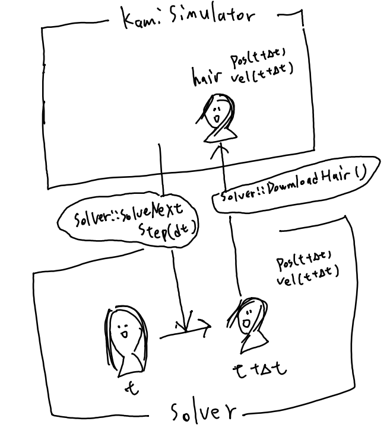

# Solver Interfaces



The Solver class is a pure virtual function. This class communicates with KamiSimulator closely (Look at the above figure).
You must to imprement four functions to use; ```Solver::Construct(string settingJsonPath)```, ```Solver::SolveNextStep(float dt)```,  ```Solver::UploadHair()```, and, ```Solver::DownloadHair()```.

You can use any data structure in the Solver. However, the result hair must be sent to render hair in KamiSimulator; therefore, the structure of the downloaded hair must align with ```class Hair```'s structure in  ```Solver::UploadHair()``` and ```Solver::DownloadHair()```.

The descriptions of the Solver's functions that includes prementioned four functions are listed below.

- ```Construct(string settingJsonPath)```
  This function prepares its solver. You can use .json to give parameters to the solver. See [JSON utility's guide](json.mp) for more details. This function is called while ```KamiSimulator::ConfirmSimulationEnvironment()``` is ongoing.
- ```void SolveNextStep(float dt)``` dt : step size [ms].
  In most cases, the result must be sent and updated to ```KamiSimulator::Hair``` by calling ```Solver::DownloadHair()```.
- ```void UploadHair()```
  Communicates between the solver and KamiSimulator.
- ```void DownloadHair()```
  Communicates between the solver and KamiSimulator. This function overwrites the hair in KamiSimulator with the Solver's state.
- ```string GetInfoString()```
  This function provides information to KamiSimulator as a string.
  The string is printed once in ```KamiSimulator::Simulate()``` before the simulation starts.
  ```JsonParser::Dump()``` will help you if you use JsonParser.
